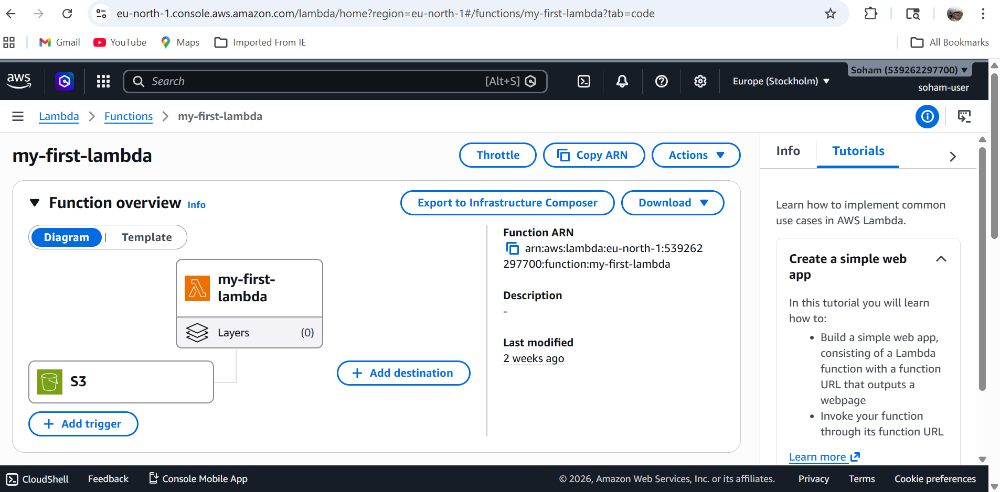
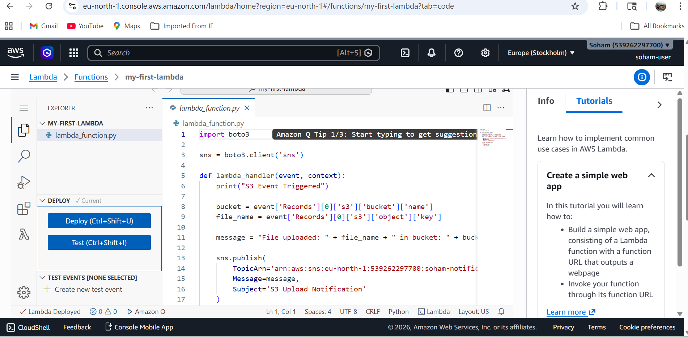
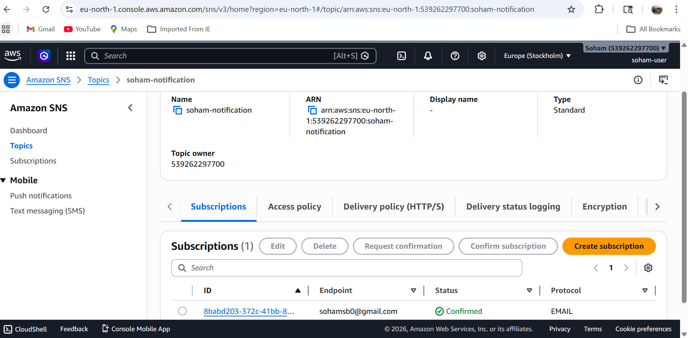
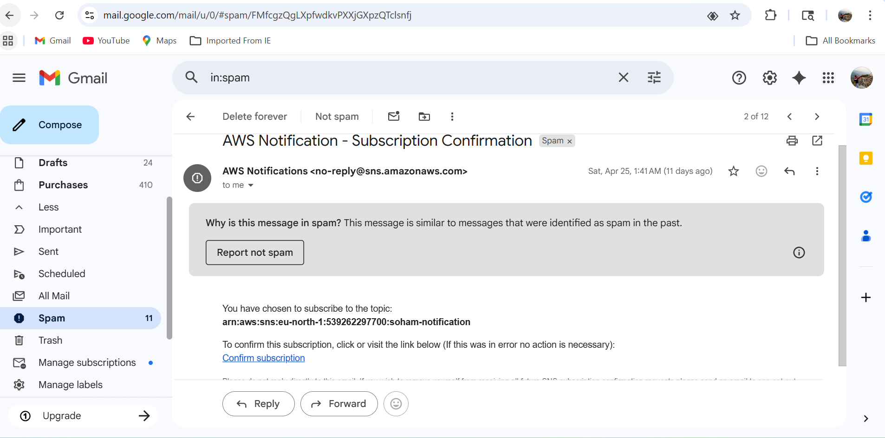

# Event-Driven AWS Mini Application using AWS Lambda

## 📌 Project Overview

Developed an event-driven AWS mini application using Lambda, S3, SNS, and IAM.

## 🚀 Technologies Used

* AWS Lambda
* Amazon S3
* Amazon SNS
* AWS IAM
* Python (Boto3)

## ⚙️ Architecture

1. User uploads file to S3 bucket
2. S3 triggers AWS Lambda function
3. Lambda processes event
4. SNS sends notification (Email)

## 🔄 Workflow

S3 Upload → Lambda Trigger → SNS Notification

## 📸 Screenshots

### S3 Event Trigger

### Lambda Function

### SNS Topic

### Email Notification

